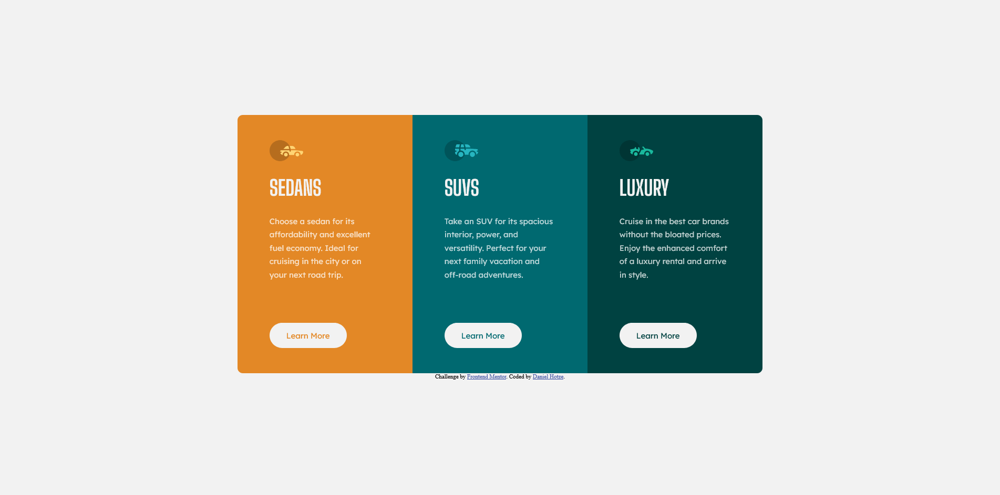

# Frontend Mentor - 3 Column Preview Card

This is a solution to the [3-Column Preview Card challenge on Frontend Mentor](https://www.frontendmentor.io/challenges/3column-preview-card-component-pH92eAR2-/hub/3column-preview-card-component-Byz3JwNX9). Frontend Mentor challenges help you improve your coding skills by building realistic projects.

## Table of contents

- [Overview](#overview)
  - [The challenge](#the-challenge)
  - [Screenshot](#screenshot)
  - [Links](#links)
- [My process](#my-process)
  - [Built with](#built-with)
  - [What I learned](#what-i-learned)
  - [Continued development](#continued-development)
  - [Useful resources](#useful-resources)
- [Author](#author)

## Overview

### The challenge

Users should be able to:

- View the optimal layout depending on their device's screen size
- See hover states for interactive elements

### Screenshot

### Links

- Solution URL: [Add solution URL here](https://github.com/DeveloperDwarf/FrontEnd-Mentor/tree/main/order-summary-component-main)
- Live Site URL: [Add live site URL here](https://DeveloperDwarf.github.io/)

## My process

### Built with

- Semantic HTML5 markup
- CSS custom properties
- Flexbox

### What I learned
I learned some more thing about the flexbox layout and how to use the flex-direction to make the content adapt to the users screen size. I also learned some more about making good looking buttons and hover effects.

### Continued development

The next small projects I will work on will also be HTML/CSS beginner and junior Challenges from frontendmentor to become more comfortable with writing HTML/CSS. I definitly need to learn some more about CSS layout (Flexbox, Grid,...) and will soon start doing harder challenges which really make more use of those tools. I will also soon start incorporating some JavaScript and/or Bootstrap into my projects.

### Useful resources

- [CSS-Tricks Flexbox Guide](https://css-tricks.com/snippets/css/a-guide-to-flexbox/) - This helped me a lot with understanding the basics of using Flexbox layout. Gonna come back to this one for my next projects aswell till I am really good at using it.
- [MDN Webdocs](https://developer.mozilla.org/de/docs/Web/CSS) - This one is always great to search for things I dont remember anymore or when I dont know how to use a property. The tutorials are pretty good aswell.
- [Stackoverflow](https://stackoverflow.com/) - We know it, we love it. Always helps you out when you get really stuck on a problem and need a hint on how to progress. When you have a problem, somebody probably had it aswell and asked for help on the internet.

## Author

- Frontend Mentor - [@yDeveloperDwarf(https://www.frontendmentor.io/profile/DeveloperDwarf)
